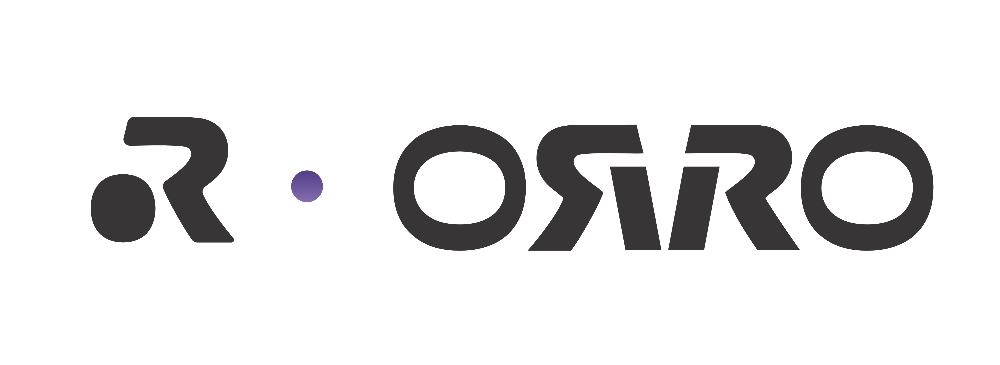

# 🪑 orro — control your standing desk from the terminal



> A snappy CLI for Orro and other Tuya-based standing desks. Move up, down, hit a preset, or drive to an exact height — all without leaving your shell.

[](https://go.dev)
[](LICENSE)
[](https://github.com/yashiels/orro-cli/actions)

---

## Features

- **Single static binary** — no Python runtime, virtualenv, or pip required; ships via Homebrew
- **LAN-first, cloud fallback** — sub-second local control via native Tuya protocol; automatic fallback to the Tuya Cloud API when LAN is unreachable
- **Tuya v3.3 + v3.4 native** — implements AES-128-ECB and HMAC-SHA256 session negotiation directly; no tinytuya dependency
- **Exact height targeting** — `orro height 110` drives the desk to 110 cm and stops; no manual hold required
- **Memory presets** — `orro sit` / `orro stand` recall named slots; `orro goto mem2` hits any slot directly
- **1Password integration** — reads all credentials from your vault when the `op` CLI is present; no plain-text secrets needed
- **Machine-readable output** — every command supports `--output json` for scripting and status bars
- **Zero-friction setup** — `orro config init` walks you through credentials interactively

---

## Install

### Homebrew (recommended)

```bash
brew install yashiels/tap/orro
```

This auto-taps `yashiels/tap` and keeps `orro` updated with `brew upgrade`.

### Pre-built binary

Download from [Releases](https://github.com/yashiels/orro-cli/releases):

```bash
# macOS Apple Silicon
curl -L https://github.com/yashiels/orro-cli/releases/latest/download/orro-darwin-arm64.tar.gz | tar xz
sudo mv orro /usr/local/bin/

# macOS Intel
curl -L https://github.com/yashiels/orro-cli/releases/latest/download/orro-darwin-amd64.tar.gz | tar xz
sudo mv orro /usr/local/bin/

# Linux amd64
curl -L https://github.com/yashiels/orro-cli/releases/latest/download/orro-linux-amd64.tar.gz | tar xz
sudo mv orro /usr/local/bin/
```

### From source

```bash
git clone https://github.com/yashiels/orro-cli.git
cd orro-cli
go install ./cmd/orro/
```

---

## Quick Start

```bash
# First-time setup — follow the prompts
orro config init

# Check connection and current height
orro status

# Go to your standing position
orro stand

# Go to your sitting position
orro sit

# Drive to an exact height
orro height 110
```

---

## Commands

### Desk control

| Command              | Description                                                     |
|----------------------|-----------------------------------------------------------------|
| `orro status`        | Show desk height, connection path, and protocol in use         |
| `orro up`            | Move desk up continuously (send `orro stop` to halt)           |
| `orro down`          | Move desk down continuously (send `orro stop` to halt)         |
| `orro stop`          | Stop any in-progress desk movement                             |
| `orro sit`           | Recall the configured sit preset (default: `mem1`)             |
| `orro stand`         | Recall the configured stand preset (default: `mem3`)           |
| `orro goto <slot>`   | Recall a specific memory slot — `mem1`, `mem2`, `mem3`, `mem4` |
| `orro height <cm>`   | Drive desk to an exact height in centimetres, then stop        |
| `orro presets`       | Show preset mapping and the heights stored in each device slot |

### Configuration

| Command               | Description                                                    |
|-----------------------|----------------------------------------------------------------|
| `orro config init`    | Interactive first-time setup wizard; prints a template if not a TTY |
| `orro config show`    | Print current resolved config (secrets redacted)              |
| `orro config path`    | Print the config file path in use                             |
| `orro config set`     | Write individual config values (see flags below)              |

`orro config set` flags:

```
--endpoint        Tuya API endpoint URL
--access-id       Tuya Access ID
--access-secret   Tuya Access Secret
--device-id       Tuya device ID
--local-key       Device local encryption key (required for LAN)
--lan-ip          Device LAN IP address
--lan-version     Tuya LAN protocol version (e.g. 3.4)
```

### Global flags

| Flag                    | Description                                               |
|-------------------------|-----------------------------------------------------------|
| `--output table\|json`  | Output format — `table` (human) or `json` (machine)      |
| `--json`                | Shorthand alias for `--output json`                       |
| `--cloud`               | Skip LAN and use Tuya Cloud API directly                  |
| `--verbose`, `-v`       | Print debug information (connection steps, raw responses) |
| `--quiet`, `-q`         | Suppress informational banners                            |
| `--config <path>`       | Use a custom config file path                             |
| `--version`             | Print version and exit                                    |

---

## Configuration

### Priority order

Settings are resolved in this order (highest wins):

1. CLI flags (`--cloud`, `--config`, etc.)
2. Environment variables (`ORRO_*`)
3. TOML config file (`~/.config/orro/config.toml`)
4. 1Password vault (`OpenClaw` → `Tuya IoT Platform`)
5. Built-in defaults

### Config file

Default location: `~/.config/orro/config.toml` (created with `0600` permissions).
Override with `ORRO_CONFIG` or `--config <path>`.

```toml
endpoint = "https://openapi.tuyaeu.com"
access_id = "your_access_id"
access_secret = "your_access_secret"
device_id = "your_device_id"

# Optional — required for LAN-first control
local_key = "your_local_key"
lan_ip = "192.168.10.95"
lan_version = "3.4"

[presets]
sit = "mem1"
stand = "mem3"
```

### Environment variables

| Variable             | Config field     |
|----------------------|------------------|
| `ORRO_ENDPOINT`      | `endpoint`       |
| `ORRO_ACCESS_ID`     | `access_id`      |
| `ORRO_ACCESS_SECRET` | `access_secret`  |
| `ORRO_DEVICE_ID`     | `device_id`      |
| `ORRO_LOCAL_KEY`     | `local_key`      |
| `ORRO_LAN_IP`        | `lan_ip`         |
| `ORRO_LAN_VERSION`   | `lan_version`    |
| `ORRO_CONFIG`        | config file path |

Advanced JSON overrides: `ORRO_LAN_DP_MAP` (JSON object of DP codes), `ORRO_PRESETS` (JSON object of preset mappings).

### 1Password integration

When the `op` CLI is installed and signed in, `orro` reads credentials automatically from `OpenClaw` → `Tuya IoT Platform`. Expected field names:

| 1Password field  | Config field     |
|------------------|------------------|
| `API Endpoint`   | `endpoint`       |
| `Access ID`      | `access_id`      |
| `Access Secret`  | `access_secret`  |
| `Device ID`      | `device_id`      |
| `Local Key`      | `local_key`      |
| `LAN IP`         | `lan_ip`         |
| `LAN Version`    | `lan_version`    |
| `LAN DP Map`     | `lan_dps` (JSON) |
| `Presets`        | `presets` (JSON) |

No config file is needed when 1Password is configured.

---

## Getting Tuya Credentials

1. Add your desk to the **Tuya Smart** or **SmartLife** mobile app.
2. Create a free account at [iot.tuya.com](https://iot.tuya.com) and create a **Cloud Project**.
3. Subscribe to the **IoT Core** and **Authorization Token Management** APIs.
4. Under **Devices → Link Tuya App Account**, link your SmartLife account.
5. Note your **Access ID**, **Access Secret**, and **API Endpoint** (choose the region closest to you).
6. In the device list, find your desk's **Device ID**; its **Local Key** appears in the device details panel.

> **Tip:** `orro config init` walks through all of this interactively and writes the file for you.

---

## How It Works

### LAN-first, cloud fallback

`orro` connects directly to your desk over TCP port 6668 using the Tuya LAN protocol. LAN control requires `local_key` and `lan_ip` in config and is dramatically faster (sub-100 ms vs ~800 ms for cloud). When LAN is unreachable, `orro` falls back to the Tuya Cloud REST API automatically. Use `--cloud` to skip the LAN attempt entirely.

### Tuya LAN protocol

The LAN path implements the Tuya binary protocol directly:

- **v3.3** — AES-128-ECB encrypted JSON with CRC32 packet checksum
- **v3.4** — session key negotiation (3-message exchange), then AES-128-ECB with HMAC-SHA256 packet authentication
- **UDP discovery** — listens on ports 6666/6667 for device broadcasts when no `lan_ip` is configured

### Tuya Cloud API

The cloud path uses Tuya's OpenAPI with HMAC-SHA256 request signing. All calls go to the regional endpoint you configure (`openapi.tuyaeu.com` for EU, `openapi.tuyaus.com` for US, etc.).

### Height targeting

`orro height <cm>` issues a move command then polls `height_display` (DP 152 by default) at 500 ms intervals until the desk reaches the target within ±5 mm, then sends stop.

### DP codes

Default DP codes are tuned for Orro desks (Tuya category `sjz`). Most Tuya-based standing desks use the same codes. Override via `ORRO_LAN_DP_MAP` (JSON) or a `[lan_dps]` section in the config file.

---

## Development

```bash
git clone https://github.com/yashiels/orro-cli.git
cd orro-cli

go build ./cmd/orro/         # build
go test ./...                # test
go vet ./...                 # vet
make build                   # build with version ldflags
make release                 # cross-compile all targets
```

### Release process

Push a `v*` tag. The release workflow cross-compiles for Darwin (amd64/arm64), Linux (amd64/arm64), and Windows (amd64), creates a GitHub release with tarballs, then dispatches a tap update to `yashiels/homebrew-tap`.

---

## Supported Desks

Tested with **Orro** standing desks. Should work with any Tuya-based standing desk that exposes standard movement and height DPs. Not affiliated with Orro or Tuya.

---

## License

MIT — [Yashiel Sookdeo](https://github.com/yashiels)